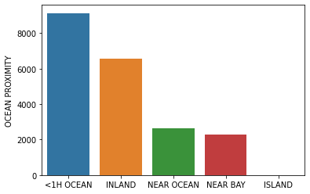

# CA-Housing
Repo to analyze the house prices in California over the years. The data has been obtained from https://www.kaggle.com/camnugent/california-housing-prices.  
### Short description
The housing prices depend highly on the closeness to the ocean. This is shown using a barplot and a pivot table:  
    
  
Certain variables show high correlations among each other, which is a plus point to this analysis:  
  
